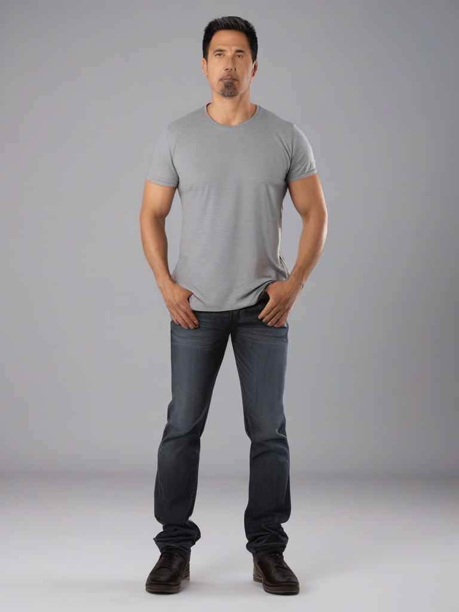
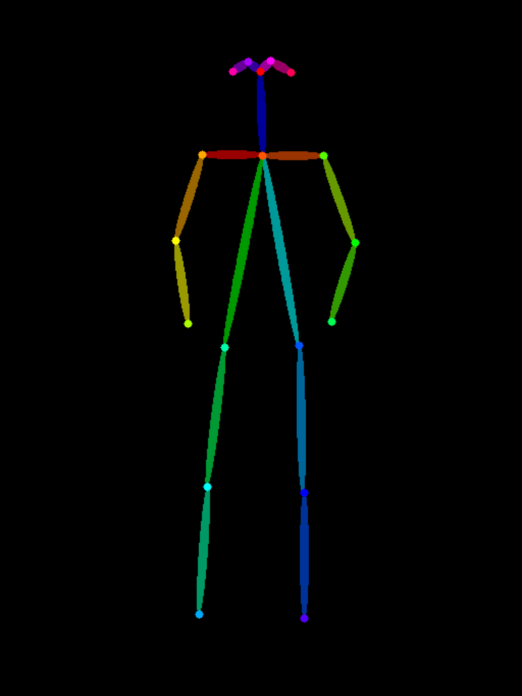
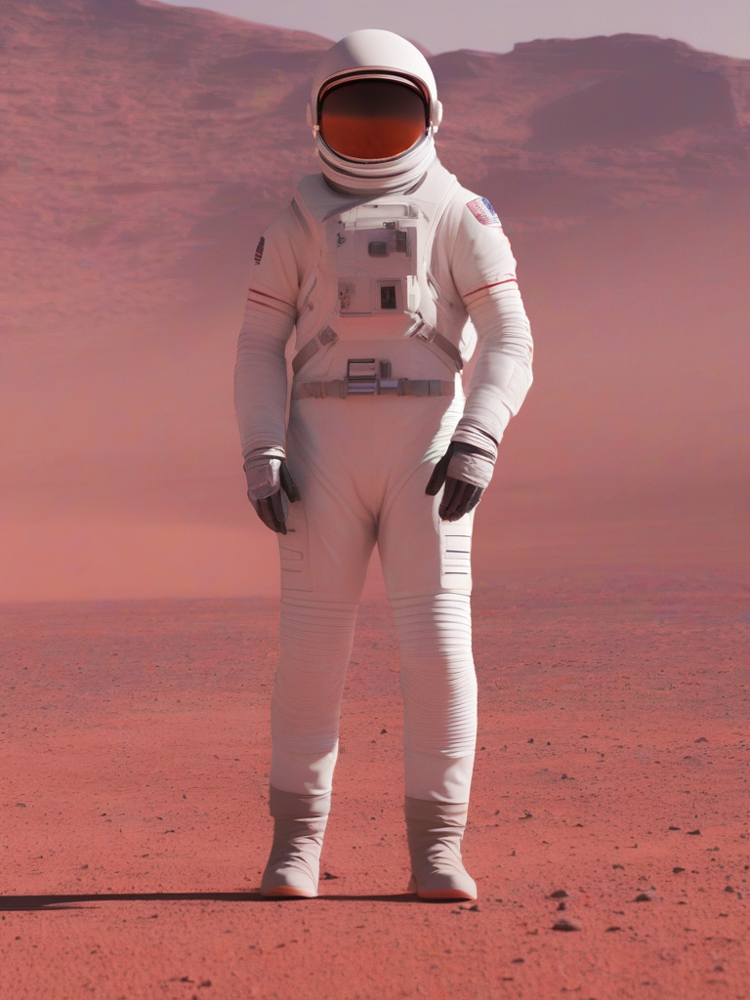
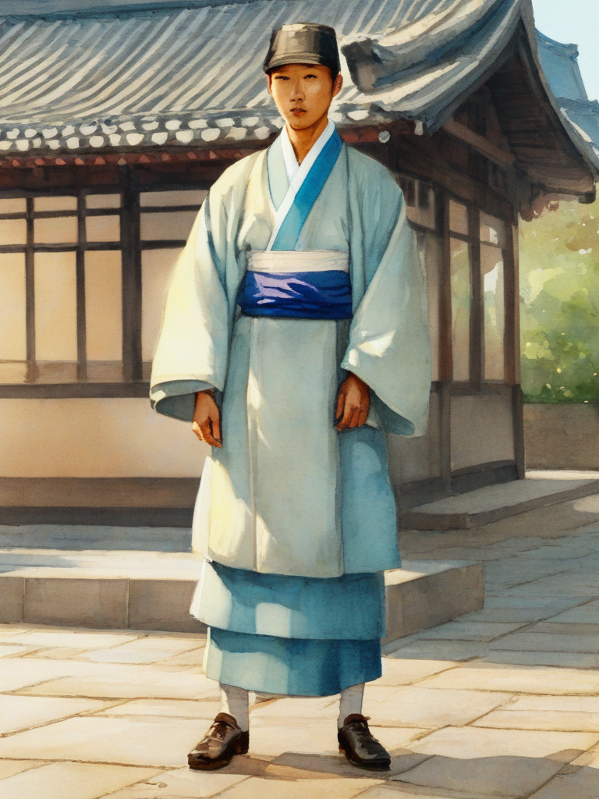
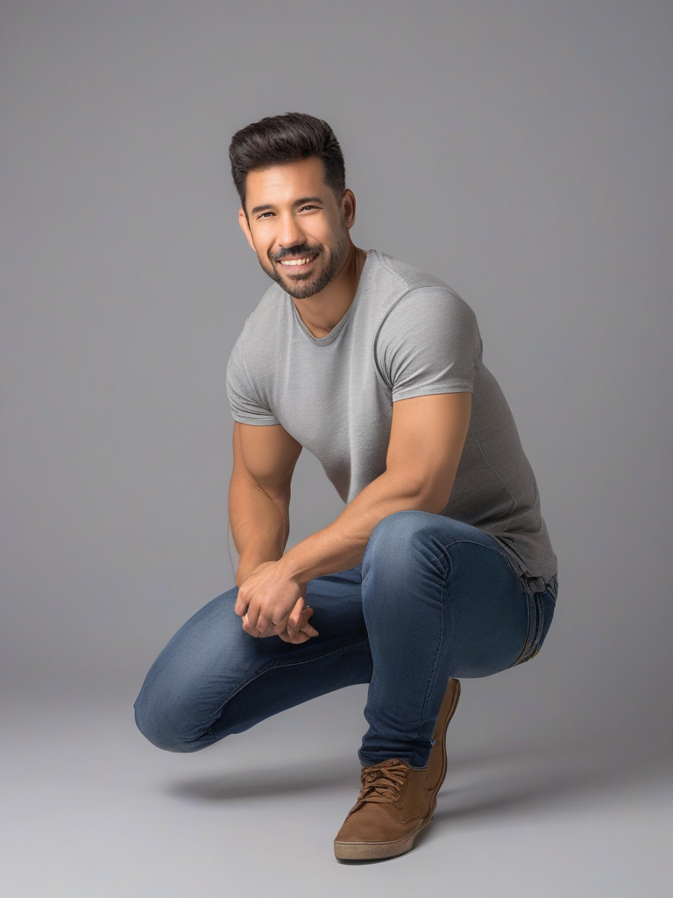
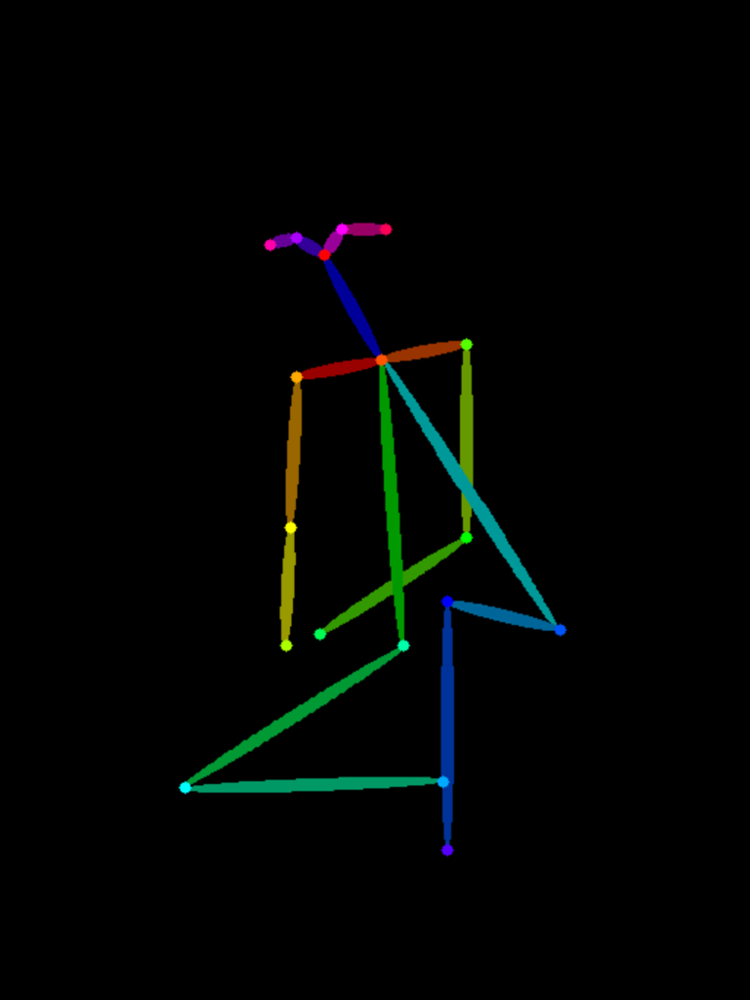
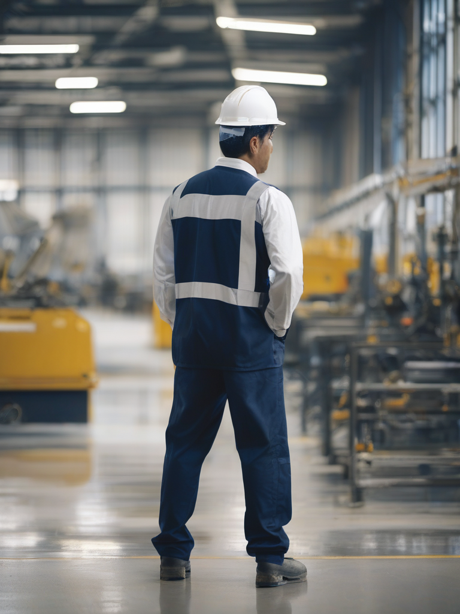
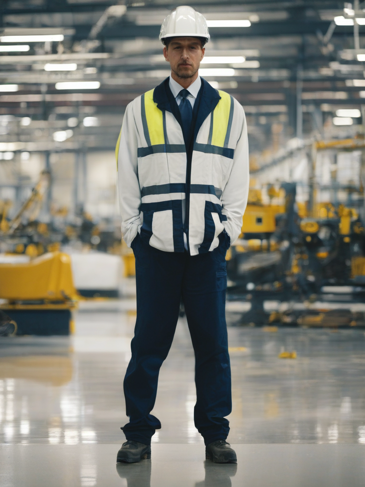
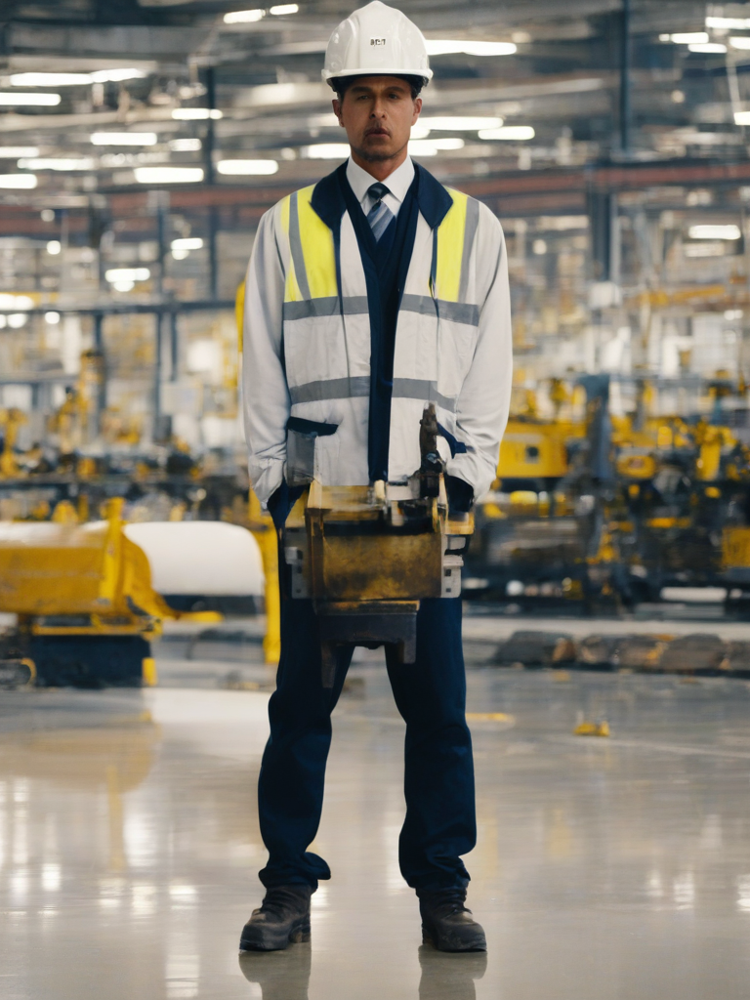

# 원하는 포즈로 이미지 만드는 도구

[](https://colab.research.google.com/github/rome777/pose-image-tool/blob/main/pose_tool.ipynb)

## 도구 설명

참조 사진 한 장에서 **사람의 관절 위치만** 뽑아, 그 자세를 그대로 유지한 채
**다른 인물·다른 장소·다른 화풍**의 이미지를 만드는 Colab 노트입니다.

프롬프트로는 자세를 정확히 지시할 수 없습니다. 이 저장소의 참조 사진이 바로 그 증거입니다 — 만들 때
"왼팔을 머리 위로 들고 오른팔을 옆으로 뻗은"이라고 적었는데 모델은 두 팔을 내린 평범한 자세를 내놓았습니다.
그래서 자세는 ControlNet(OpenPose)이 맡고, 나머지 다섯 칸(피사체·카메라·조명·환경·스타일)은 프롬프트가 맡습니다.

```
참조 사진  ──OpenPose──▶  관절 뼈대 그림  ──┐
                                            ├──▶ SDXL + ControlNet ──▶ 결과 이미지
프롬프트(나머지 다섯 칸) ───────────────────┘
```

| 구성 | 쓴 것 | 라이선스 |
|---|---|---|
| 본체 모델 | `stabilityai/stable-diffusion-xl-base-1.0` | CreativeML Open RAIL++-M |
| 포즈 ControlNet | `thibaud/controlnet-openpose-sdxl-1.0` | OpenRAIL |
| fp16 VAE | `madebyollin/sdxl-vae-fp16-fix` | MIT |
| 포즈 추출 | `controlnet_aux` + `lllyasviel/Annotators` | Apache 2.0 |

> **모델 선택 이유.** 수업 실습 모델인 FLUX.2-klein 4B는 2026-07 기준 공식 ControlNet이 없습니다.
> 커뮤니티 ControlNet(Alibaba-PAI)은 klein이 아니라 dev 기반이라 검증 부담이 있어,
> 포즈 조건이 가장 잘 갖춰져 있고 무료 T4에서 도는 SDXL 계열을 골랐습니다.
> 대신 수업에서 배운 것 — **증류 여부에 따라 스텝 수와 가이던스를 맞춘다** — 은 그대로 적용했습니다.
> SDXL은 증류판이 아니므로 `steps=25`, `guidance_scale=5.0` 입니다.
> (증류판인 SDXL-Turbo·FLUX.2-klein이라면 `steps=4`, `guidance_scale=0.0` 이어야 합니다.)

## 사용법

1. 위의 **Open in Colab** 배지를 누르거나
   `https://colab.research.google.com/github/rome777/pose-image-tool/blob/main/pose_tool.ipynb` 로 엽니다.
2. **런타임 → 런타임 유형 변경 → 하드웨어 가속기: T4 GPU** 로 먼저 바꿉니다. 안 바꾸면 1번 셀에서 멈춥니다.
3. 위에서부터 셀을 차례로 실행합니다 (`Ctrl+F9` 로 전체 실행해도 됩니다).
   - 1~2: GPU 확인, 라이브러리 설치
   - 3~4: 설정값, 파이프라인 로드 (모델 내려받기 처음 한 번만, **반복문 밖에서 한 번만**)
   - 5~6: 참조 사진 준비 → OpenPose로 관절 뼈대 추출
   - 7: 생성 함수 정의 (이미지 + 재현용 JSON 기록)
   - 8~10: 실험 — 프롬프트만 바꾸기 / 포즈만 바꾸기 / 자세 강제 세기 바꾸기
   - 11: 재현성 확인 (같은 시드로 다시 뽑아 픽셀 비교)
   - 12: 결과 zip 내려받기
4. 결과 이미지는 Colab의 `out/` 에 쌓이고, 마지막 셀이 `pose_tool_outputs.zip` 으로 묶어 내려받습니다.
   이미지마다 `out/{이름}.json` 에 프롬프트·시드·모델·스텝·가이던스가 함께 저장됩니다.

참조 사진은 기본값이 **직접 생성**입니다(`REFERENCE_SOURCE = "generate"`).
남의 사진을 쓰지 않으므로 저작권 문제가 없고, 시드가 같으면 참조 사진부터 재현됩니다.
내 사진을 쓰려면 `REFERENCE_SOURCE = "upload"` 로 바꾸십시오.

## 테스트 결과

무료 Colab T4에서 실제로 돌린 결과가 `samples/` 에 그대로 들어 있습니다.
한 장에 약 26초(25스텝, 1.05s/it)였습니다.

### 실험 1 — 자세는 그대로, 프롬프트만 바꿈

| 참조 사진 | 뼈대 (ControlNet 입력) | 공장 노동자 | 우주 비행사 | 한복 차림 선비 |
|---|---|---|---|---|
|  |  |  |  |  |

**자세가 세 장 모두 유지됐습니다.** 정면을 보고, 두 팔을 내리고, 발을 어깨너비로 벌린 그대로입니다.
바뀐 것은 인물·옷·배경·화풍뿐이고, 프롬프트에는 자세를 한 글자도 적지 않았습니다.
세 번째 장은 지시한 대로 화풍까지 수채화 일러스트로 넘어갔습니다.

### 실험 2 — 프롬프트는 그대로, 자세만 바꿈

| 참조 사진 | 뼈대 | pose_01 결과 | pose_02 결과 |
|---|---|---|---|
|  |  |  |  |

프롬프트는 `output_01`과 **한 글자도 다르지 않고 시드도 같습니다.** 뼈대만 바꿨습니다.
안전모와 남색 작업복, 공장 배경은 유지된 채 **자세만 무릎 꿇은 자세로 바뀌었습니다.**
프롬프트는 "무엇이 있는가", 뼈대는 "어떤 자세인가"를 담당한다는 것이 눈으로 확인됩니다.

### 실험 3 — 자세 강제 세기만 바꿈 (`controlnet_conditioning_scale`)

| scale 0.3 | scale 0.8 (기본값) | scale 1.2 |
|---|---|---|
|  |  |  |
| **인물이 뒤로 돌아섰습니다.** 서 있다는 것만 맞고 방향·팔 위치가 뼈대와 어긋납니다 | 뼈대를 그대로 따르면서 화풍·조명 지시도 살아 있습니다 | 자세는 정확한데 **손이 무너지고** 손 자리에 주인 없는 기계 부품이 붙었습니다 |

"자세가 안 따라온다"는 문제는 프롬프트를 고칠 일이 아니라 이 값을 올릴 일입니다.
다만 올릴수록 손이 나빠지므로 1.0을 크게 넘기지 않는 편이 낫습니다.

### 재현성

같은 시드·프롬프트·뼈대로 다시 뽑은 `repro_check.png` 는 `output_01.png` 와 **픽셀 차이 0**,
파일 해시(`ef353293140b255f…`)까지 동일했습니다. `scale_08.png` 도 기본값과 같은 조건이라 같은 파일이 나왔습니다.

```
output_01.png    ef353293140b255f
repro_check.png  ef353293140b255f
scale_08.png     ef353293140b255f
output_02.png    f5bdc989f4e197c4   (뼈대만 다름)
```

### 파일 목록

| 파일 | 내용 |
|---|---|
| `pose_01_ref.png`, `pose_02_ref.png` | 참조로 쓴 사진 (노트가 생성) |
| `pose_01.png`, `pose_02.png` | 거기서 뽑은 관절 뼈대 (ControlNet 입력) |
| `output_01.png`, `output_01b.png`, `output_01c.png` | pose_01 자세에 프롬프트만 바꾼 결과 |
| `output_02.png` | output_01과 같은 프롬프트에 pose_02 자세 |
| `scale_03.png`, `scale_08.png`, `scale_12.png` | 자세 강제 세기만 바꾼 결과 |
| `repro_check.png` | output_01과 같은 조건으로 다시 뽑은 것 (재현성 확인용) |
| `*.json` | 각 이미지의 프롬프트·시드·모델·스텝·가이던스 |

프롬프트 전문은 [`prompts.md`](prompts.md) 에 있습니다.

## 한계

- **프롬프트로는 자세가 안 잡힙니다.** 참조 사진을 만들 때 요청한 팔 동작이 통째로 무시된 것이 그 예입니다.
  이 도구가 존재하는 이유이기도 합니다.
- **참조 사진에서 가려진 관절은 조건에 없습니다.** 팔이 몸통 뒤로 숨은 사진을 넣으면 그 팔은 모델이 제멋대로 그립니다.
  이때 프롬프트를 고치는 것은 소용이 없고, **참조 사진을 바꿔야** 합니다.
- **손가락은 여전히 무너집니다.** 손 관절을 끄고(`hand_and_face=False`) 돌렸기 때문에 손 정보가 조건에 없고,
  잠재 공간에서 손이 차지하는 자리가 원래 좁습니다. `scale_12.png` 가 그 실패를 보여 줍니다.
- **뼈대와 프롬프트가 충돌하면 둘 다 아닌 그림이 나옵니다.** 앉은 자세 뼈대에 "걸어가는 사람"이라고 적으면 망가집니다.
  프롬프트에서 **동작 칸은 비워 두는 것이 맞습니다.** 그 칸은 이미 뼈대가 채웠습니다.
- **`enable_model_cpu_offload()` 를 두 파이프라인에 모두 걸면 안 됩니다.** 같은 모듈을 공유하므로 훅이 두 겹으로
  붙어 매 스텝 CPU와 GPU를 오가느라 한 장에 몇 분씩 걸립니다. 처음 돌렸을 때 실제로 이 일이 일어나서,
  두 파이프라인을 그냥 `.to("cuda")` 로 올리는 쪽으로 고쳤습니다.
- **`float16` 주의.** SDXL을 float16으로 돌리면 결과가 통째로 검게 나오는 알려진 문제가 있어
  `madebyollin/sdxl-vae-fp16-fix` 를 씁니다. 이걸 빼면 검은 이미지가 나올 수 있습니다.
- 무료 Colab T4 기준 한 장에 약 26초입니다. 증류 모델처럼 1초에 한 장씩 뽑아 가며 감을 잡는 방식은 여기서는 안 됩니다.

## AI 생성물 표기

`samples/` 의 모든 이미지는 AI로 생성한 것입니다. **실제 인물·장소를 찍은 사진이 아닙니다.**
참조 사진까지 생성물이라 실존 인물의 초상이 들어가지 않습니다.
